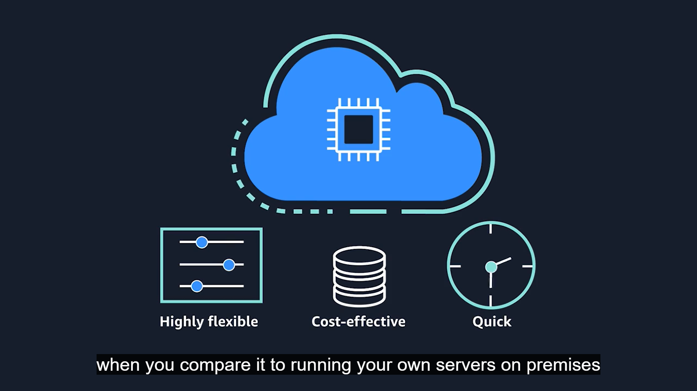
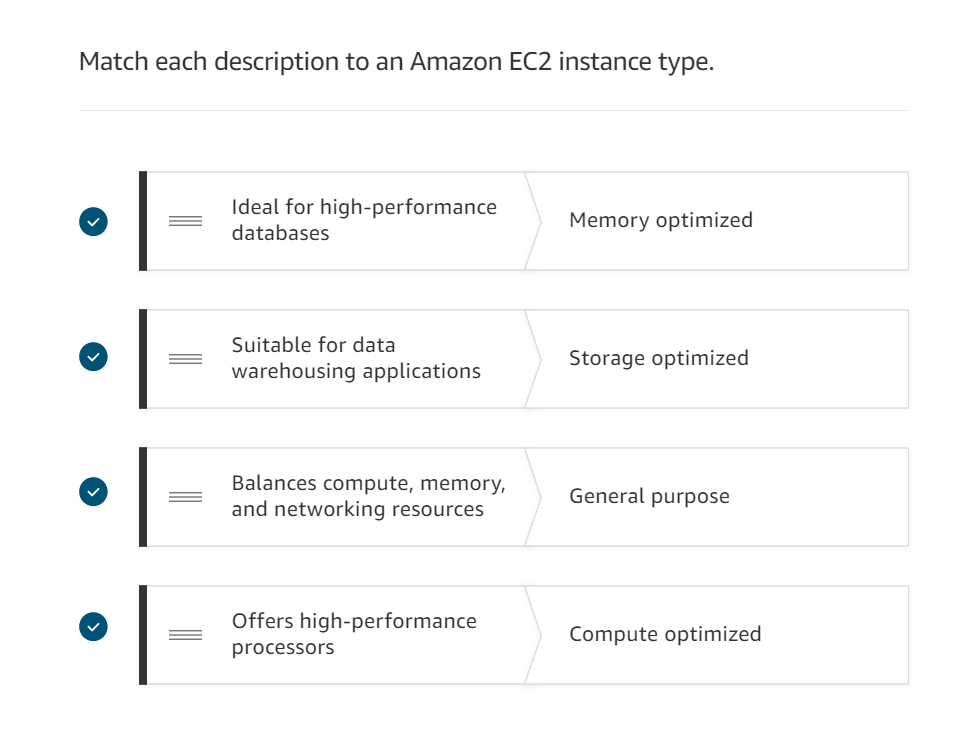

### Amazon Elastic Compute Cloud (Amazon EC2)

Amazon Elastic Compute Cloud (Amazon EC2) provides secure, resizable compute capacity in the cloud as Amazon EC2 instances.

You need raw compute capacity to host your applications and provide the compute-power that your business needs.
When you're working with AWS, those servers are virtual.
And the service we use to gain access to virtual servers is called **EC2**.

Following are the advantages of EC2 👇

#### Amazon EC2 instance types

There are five types of EC2 instances.

**1. General Purpose Instances**

It provides a balance of compute, memory, and networking resources. It is used in:
- application servers
- gaming servers
- backend servers for enterprise applications
- small and medium databases

If your application doesn't require any optimization in any single resource area, then General Purpose Instance
is the best choice.

**2. Compute optimized instances**

It is ideal for compute-bound applications that benefit from high-performance processors.
Similar to General Purpose Instances, Compute Optimized can also be used forworkloads such as web, application, and gaming servers.

However, the difference is compute optimized applications are ideal for high-performance web servers, 
compute-intensive applications servers, and dedicated gaming servers. We can also use compute 
optimized instances for batch processing workloads that require 
processing many transactions in a single group.

**3. Memory optimized instances**

It is designed to deliver fast performance for workloads that process large datasets in memory.
>In computing, memory is a temporary storage area. It holds all the data and instructions that a central processing unit (CPU) needs to be able to complete actions. Before a computer program or application is able to run, it is loaded from storage into memory. This preloading process gives the CPU direct access to the computer program.

Suppose that we have a workload that requires large amounts of data to be preloaded 
before running an application. This scenario might be a high-performance database or a workload 
that involves performing real-time processing of a large amount of unstructured data.

**4. Accelerated computing instances**

Accelerated computing instances use hardware accelerators, or coprocessors, to perform some functions more efficiently than is possible in software running on CPUs.

Examples of these functions include: 
- floating-point number calculations
- graphics processing, and 
- data pattern matching.
>In computing, a hardware accelerator is a component that can expedite data processing.

**5. Storage optimized instances**

Storage optimized instances are designed for workloads that require high, sequential read and write access to large datasets on local storage. Examples of workloads suitable for storage optimized instances include distributed file systems, data warehousing applications, and high-frequency online transaction processing (OLTP) systems.

>In computing, the term input/output operations per second (IOPS) is a metric that measures the performance of a storage device. It indicates how many different input or output operations a device can perform in one second.

Use case: If you have an application that has a high IOPS requirement, a storage optimized instance can provide better performance over other instance types not optimized for this kind of use case.

#### Amazon EC2 Pricing

**1. On-Demand**

- Ideal for short-term, irregular workloads that cannot be interrupted
- No upfront costs or minimum contracts apply
- The instances run continuously until you stop them, and you pay for only the compute time you use
- Ex: developing and testing applications and running applications that have unpredictable usage patterns
- Not recommended for long-running applications.

**2. Savings Plan**

- It enables you to reduce your compute costs **by committing** to a consistent amount of compute usage for a 1-year or 3-year term.
- results in **savings of up to 66%** over On-Demand costs.
- Any usage beyond the commitment is charged at regular On-Demand rates.

**3. Reserved Instances**

- Billing discount applied to the use of On-Demand Instances in your account
- Standard Reserved and Convertible Reserved Instances for a 1-year or 3-year term can be purchased.
- Scheduled Reserved Instances for a 1-year term
- **Greater cost savings with the 3-year option.**
- >At the end of Reserved Instances, charges will be on-demand pricing.
  
**4. Spot Instances**

- Ideal for workloads with flexible start and end times, or that can withstand interruptions.
- It uses unused Amazon EC2 computing capacity and offer you cost **savings at up to 90% off** of On-Demand prices.
- Ex: background processing job
- Not ideal for dev/testing as spot Instances might have interruptions.

**5. Dedicated Hosts**

- Physical servers with Amazon EC2 instance capacity that is fully dedicated to your use.
- Can be used as per: existing per-socket, per-core, or per-VM software licenses to help maintain license compliance
