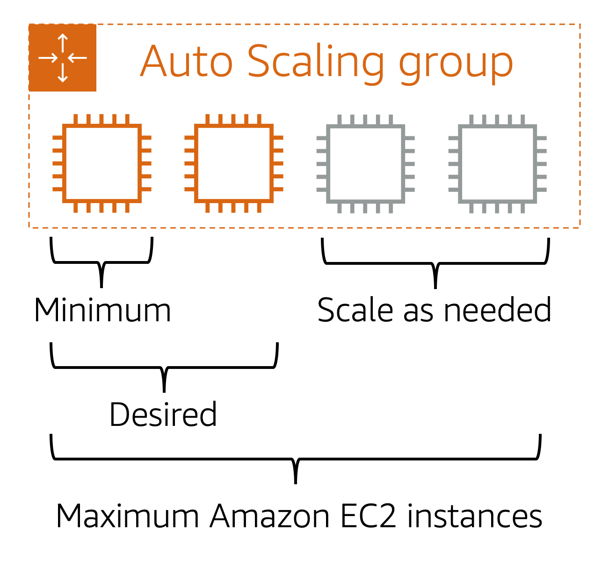

### Amazon Elastic Compute Cloud (Amazon EC2)

#### Scalability

- Only the resources we need and designing the architecture to automatically 
  respond to changing demand by scaling out or in.
- As a result, you pay for only the resources you use.
- The AWS service that provides this functionality for Amazon EC2 instances is Amazon EC2 Auto Scaling.

#### Amazon EC2 Auto Scaling

Amazon EC2 Auto Scaling enables you to automatically add or remove Amazon EC2 instances in response to changing application demand.
Scaling can be done on two approaches
1. _Dynamic scaling_ responds to changing demand. 
2. _Predictive scaling_ automatically schedules the right number of Amazon EC2 instances based on predicted demand.

